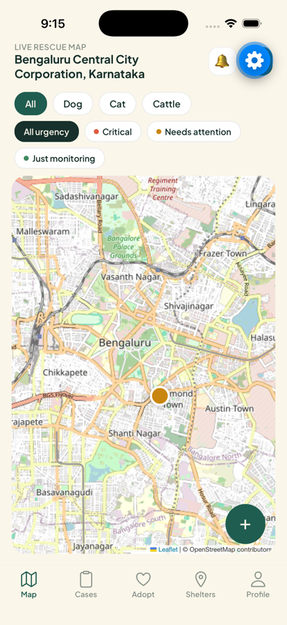
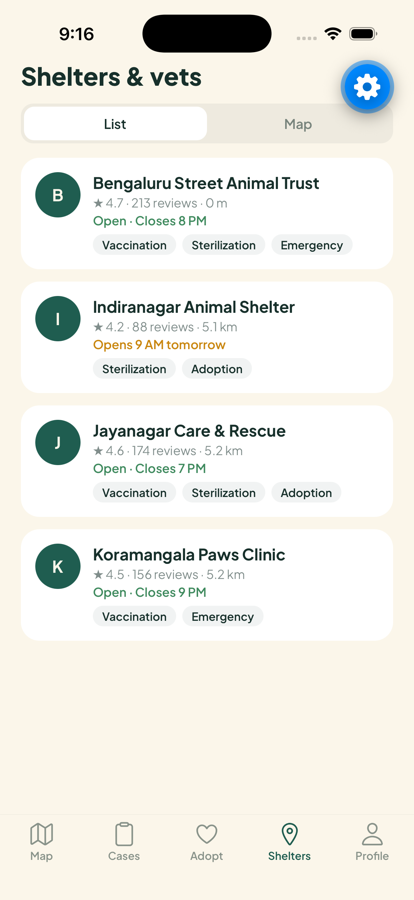
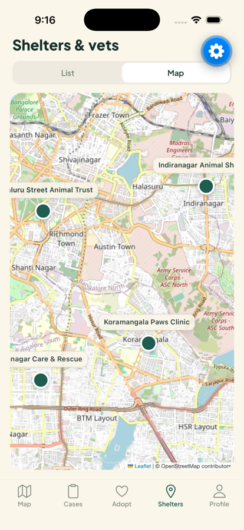
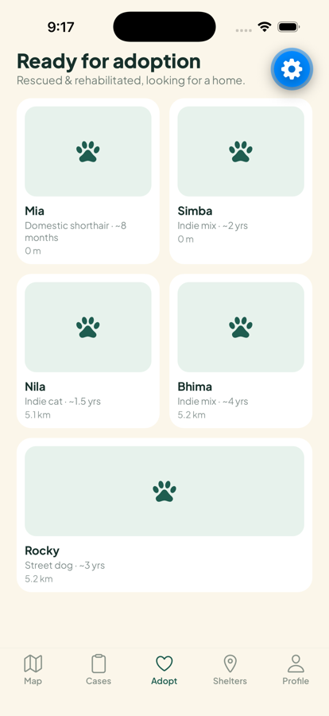
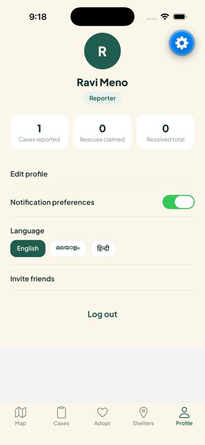

<div align="center">

# 🐾 PawPatrol — Stray Rescue

**Report a stray in distress in under 30 seconds. Get it to someone who can help.**

A community rescue-coordination app for street animals, built for Indian cities.
Reporters spot animals in trouble, volunteers claim and respond to cases, and
NGOs run the queue and verify outcomes — all on one live map.

[](https://reactnative.dev)
[](https://expo.dev)
[](https://www.typescriptlang.org)
[](https://supabase.com)
[](https://www.openstreetmap.org)
[](#-built-for-india)

</div>

---

## 📱 The app

<div align="center">

| Live rescue map | Shelters & vets | Shelters on map |
| :---: | :---: | :---: |
|  |  |  |
| Open cases near you, filtered by species and urgency | Nearest first, with live open/closed status | Named pins, framed to fit |

| Ready for adoption | Your profile |
| :---: | :---: |
|  |  |
| Rescued animals looking for homes | Real impact stats, computed from your cases |

</div>

---

## ✨ What it does

PawPatrol is built around one idea: **the person who spots a stray is rarely the
person who can rescue it.** The app closes that gap.

### 🙋 Reporter
Spot an animal in trouble and file a case in a guided five-step flow — photo,
species and condition, a map pin you can drag to the exact spot, and an urgency
level. Track everything you've reported and chat with whoever picks it up.

### 🚑 Volunteer / Rescuer
See open cases near you on a live map. Claim the nearest one with a single tap,
move it through *in progress* as you work, and coordinate directly with the
reporter.

### 🏥 NGO / Shelter
A dashboard of open, claimed and resolved counts with the most urgent cases
surfaced first. Assign or reassign any case to a real volunteer, keep internal
notes, and verify resolutions before they close.

---

## 🔐 A real state machine, not a mockup

Case status is enforced in Postgres, not in the client — every transition is a
`SECURITY DEFINER` function that checks who is asking:

```
open ──claim──▶ claimed ──advance──▶ in_progress ──advance──▶ pending_verification ──verify──▶ resolved
      (anyone but            (only the claiming volunteer)                          (NGO staff only)
       the reporter)
```

Attempting a transition you aren't entitled to fails at the database, regardless
of what the app sends:

| Attempt | Result |
| --- | --- |
| Reporter claims their own case | ❌ `Reporters cannot claim their own case` |
| Non-claimant advances a case | ❌ `Only the assigned volunteer can advance this case` |
| Volunteer verifies a resolution | ❌ `Only NGO staff can verify a resolution` |
| Volunteer assigns a case | ❌ `Only NGO staff can assign cases` |

Row-level security covers the rest: chat threads are readable only by the case's
reporter and claimant, notifications only by their owner, and nothing at all
without a session.

> The original design prototype had a "Verify resolution" button that only
> showed a toast. Here it drives a real `pending_verification → resolved`
> transition, with `case_status_history` recording who changed what and when.

---

## 🏗️ Architecture

```
apps/mobile/                  Expo app (TypeScript, Expo Router)
├── app/                      File-based routes
│   ├── (auth)/               Login, signup
│   ├── (onboarding)/         Carousel, role select
│   ├── (reporter)/           Map · Cases · Adopt · Shelters · Profile
│   ├── (volunteer)/          Queue · Map · Shelters · Profile
│   ├── (ngo)/                Dashboard · Queue · Shelters · Profile
│   ├── report/               Five-step reporting flow
│   └── case/ chat/ shelter/ adopt/
└── src/
    ├── screens/              Role-parametrised shared screens
    ├── components/           LeafletMap, CaseRow, FilterChip, …
    ├── hooks/                Data hooks (react-query + Realtime)
    ├── lib/                  Supabase client, i18n, geocoding
    └── i18n/                 en · ml · hi

supabase/migrations/          Schema, RLS, state-machine functions
docs/                         Pitch deck and screenshots
design-reference/             Original design spec and mockups
```

**Live by default.** Cases, notifications and chat subscribe to Postgres changes
over Supabase Realtime, so a case claimed on one device updates every other
session immediately — no pull-to-refresh anywhere.

**Location-scoped queries.** Shelters and adoptable animals are filtered by
great-circle distance *in Postgres* (`shelters_near`, `adoptable_animals_near`),
returning nearest-first within a 50 km radius, rather than downloading a national
table to throw most of it away.

---

## 🗺️ Maps without a credit card

Most map SDKs want a billing account before you can render a single tile.
PawPatrol uses **Leaflet + OpenStreetMap inside a WebView** instead:

- ✅ No API key, no account, no card — anywhere in the stack
- ✅ Real tiles, pins, drag-to-place markers, fit-to-bounds, named labels
- ✅ Reverse geocoding via OSM Nominatim, also keyless

Everything the design called for, at zero cost and zero signup friction.

---

## 🌏 Built for India

Fully trilingual — **English**, **മലയാളം** (Malayalam) and **हिन्दी** (Hindi) —
switchable from the profile screen and persisted per account. Species,
condition tags and urgency levels reflect what actually turns up on Indian
streets: indie dogs and cats, cattle, roadkill risk, hit-by-vehicle.

---

## 🚀 Getting started

**Prerequisites:** Node 20+, [Docker Desktop](https://www.docker.com/products/docker-desktop/)
(for the local database), and the [Supabase CLI](https://supabase.com/docs/guides/cli).

```bash
git clone https://github.com/Hrishap/pawpatrol-stray-rescue-app.git
cd pawpatrol-stray-rescue-app
```

**1. Start the backend**

```bash
supabase start
```

This runs Postgres, Auth, Storage and Realtime in Docker, applies every
migration, and seeds demo shelters and adoptable animals for Kochi and Bengaluru.

**2. Configure the app**

```bash
cd apps/mobile
cp .env.example .env    # paste the API URL and anon key printed by `supabase start`
npm install
```

**3. Run it**

```bash
npm run start
```

Press `i` for the iOS Simulator, `a` for Android, or scan the QR code with
[Expo Go](https://expo.dev/go) on your phone. The app runs in Expo Go — no
custom native build required for development.

<details>
<summary><b>Deploying to a hosted Supabase project</b></summary>

```bash
supabase link --project-ref <your-project-ref>
supabase db push          # schema, RLS, functions, demo data
supabase config push      # auth settings
```

Then point `apps/mobile/.env` at the hosted project's URL and anon key.

Email confirmations are disabled in `supabase/config.toml` so demo signups work
instantly. **Re-enable them, with a real SMTP provider, before any public
launch** — Supabase's built-in mailer is rate-limited and not intended for
production.

</details>

<details>
<summary><b>Building an installable app</b></summary>

```bash
npx eas login
npx eas build --profile preview --platform android   # APK, no paid account needed
npx eas build --profile development --platform ios   # needs an Apple Developer account
```

</details>

---

## 🧪 Quality

- **TypeScript strict mode** across the app, zero errors
- **`expo-doctor`**: 21/21 checks passing
- Backend behaviour verified end-to-end against a live Supabase instance — full
  case lifecycle across three roles, every permission rejection, RLS scoping on
  chat, and photo upload with public read
- Driven on a real iOS Simulator through signup, reporting, maps and every tab

---

## 🗺️ Roadmap

| Status | Item |
| :---: | --- |
| ✅ | Three roles, full case lifecycle, realtime, chat, notifications, i18n |
| 🚧 | Push notifications — data model and `push_tokens` are ready; needs APNs/FCM credentials |
| 🚧 | AI photo tagging — reporters tag manually today; the flow is shaped to drop a vision model in |
| 🚧 | Shelter ownership, so "Contact shelter" reaches a real inbox |
| 💡 | Volunteer presence, case photos gallery, offline queueing |

---

## 📄 Documents

- 📊 [**Pitch deck**](docs/PawPatrol_Stray_Rescue_App.pptx) — the concept and problem framing
- 📐 [**Design spec**](design-reference/PAWPATROL_SPEC.md) — full screen inventory, data model and design tokens the build was made from

---

## 🙏 Credits

Maps and geocoding © [OpenStreetMap](https://www.openstreetmap.org/copyright)
contributors. Typeface: [Plus Jakarta Sans](https://fonts.google.com/specimen/Plus+Jakarta+Sans).
Interface icons: [Material Community Icons](https://pictogrammers.com/library/mdi/).

<div align="center">
<sub>Built for the strays who can't call for help themselves.</sub>
</div>
